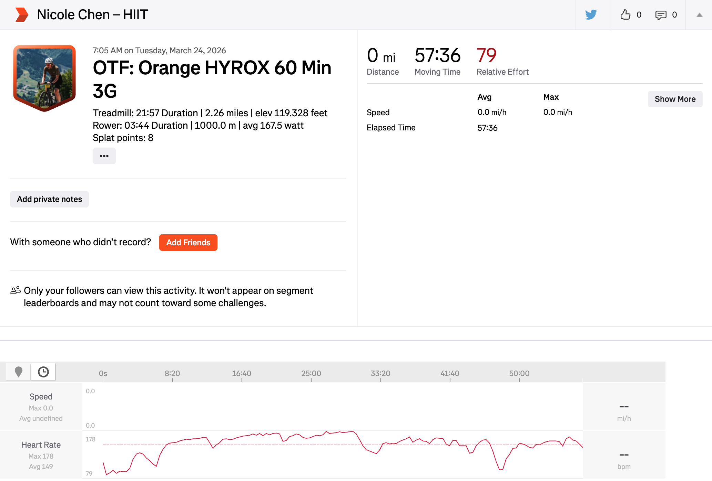

# otf-to-strava

This tool syncs OrangeTheory workouts to Strava — with real heart rate graphs, treadmill distance, and rower data. Vibe coded with Claude to satisfy my need to have all workouts centralized on Strava.



## What gets synced

| Data | How it appears |
|---|---|
| Heart rate | Native HR graph |
| Treadmill distance | Native pace/distance |
| Calories, splat points | Activity description |
| Rower distance + avg wattage | Activity description |
| Activity type | Tread → Run, Strength → WeightTraining, Hyrox → HIIT, 3G/2G → Workout |

## Setup

### Step 1: Get Strava credentials

1. Go to [strava.com/settings/api](https://www.strava.com/settings/api) and create an app
   - Website: `strava.testapp.com`
   - Authorization Callback Domain: `developers.strava.com`
2. Note your **Client ID** and **Client Secret**
3. Open this URL in your browser (replace `YOUR_CLIENT_ID`):
   ```
   https://www.strava.com/oauth/authorize?client_id=YOUR_CLIENT_ID&response_type=code&redirect_uri=http://localhost&scope=activity:read_all,activity:write&approval_prompt=force
   ```
4. Click Authorize → browser redirects to localhost (error is fine) → copy `code=` from the URL bar
5. Exchange the code for a refresh token:
   ```bash
   curl -X POST https://www.strava.com/oauth/token \
     -d client_id=YOUR_CLIENT_ID \
     -d client_secret=YOUR_CLIENT_SECRET \
     -d code=PASTE_CODE_HERE \
     -d grant_type=authorization_code
   ```
6. Copy the `refresh_token` from the response. Now you have all 3 credentials needed - `STRAVA_CLIENT_ID`, `STRAVA_CLIENT_SECRET`, `STRAVA_REFRESH_TOKEN`.

## Running the Script
### Option A: GitHub Actions (recommended)

1. Fork this repo
2. Go to **Settings → Secrets and variables → Actions** and add:
   `OTF_EMAIL`, `OTF_PASSWORD`, `STRAVA_CLIENT_ID`, `STRAVA_CLIENT_SECRET`, `STRAVA_REFRESH_TOKEN`
3. Done — the workflow runs every 20 min and syncs automatically

Trigger manually anytime from the Actions tab.

**Cron schedule:** The workflow runs every 20 minutes, assuming classes happen between 6am–10pm in ET. GitHub Actions schedules in UTC, so the window is padded by 1 hour on each side to account for daylight saving time. At ~1,620 min/month, this stays within GitHub's 2,000 free minutes for private repos.

---

### Option B: Run locally

```bash
git clone https://github.com/chenwnicole/otf-to-strava
cd otf-to-strava
python -m venv .venv && source .venv/bin/activate
pip install -r requirements.txt
```

Create a `.env` file:
```
OTF_EMAIL=your_otf_email
OTF_PASSWORD=your_otf_password
STRAVA_CLIENT_ID=your_client_id
STRAVA_CLIENT_SECRET=your_client_secret
STRAVA_REFRESH_TOKEN=your_refresh_token
```

Sample commands:
```bash
python upload_to_strava.py                     # last 30 days
python upload_to_strava.py --days 7            # last N days
python upload_to_strava.py --since 2026-01-01  # since a specific date
python upload_to_strava.py --filter Tread      # only matching workouts
python upload_to_strava.py --dry-run           # preview without uploading
```

Sample Output:
```
(.venv) otf-to-strava % python upload_to_strava.py --days 85
Fetching OTF workouts since 2026-01-01...
Found 39 workout(s)
Getting Strava access token...
Checking for existing Strava activities...
Found 11 existing Strava activity/activities in this window

[1/39] Tread 50 (2026-01-02 10:30:00)
  Uploaded with HR trace -> strava.com/activities/MASKED

[2/39] Orange 60 Min 3G (2026-01-04 08:20:00)
  Uploaded with HR trace -> strava.com/activities/MASKED

[3/39] Orange HYROX 60 Min 3G (2026-01-12 19:35:00)
  Uploaded with HR trace -> strava.com/activities/MASKED

...

Done
```

## Credits

OTF data powered by [otf-api](https://github.com/NodeJSmith/otf-api) by NodeJSmith.
